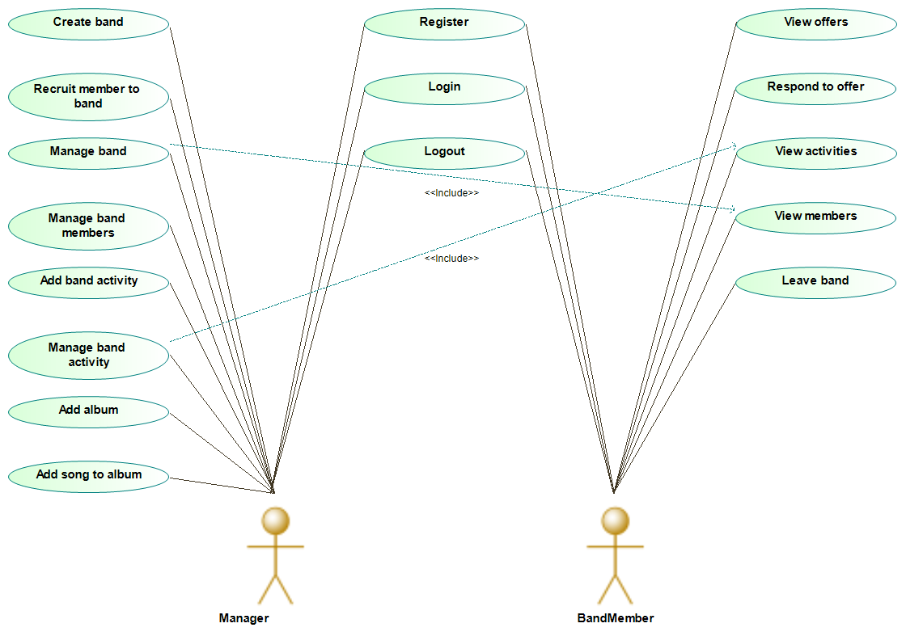

# YouBand Manager

*PA165 course - Spring 2023*

# How to run project
- Run command ```mvn clean install``` in root directory.
- Run command ```docker-compose up``` in root directory containing file *docker-compose.yml*.


# About project

-   **Name**: Music Band Manager
-   **Technologies**: Java 17, Apache Maven, Spring Boot, Apache Tomcat, Hibernate ORM
-   **Developers**:
    -   Oskar Adam Válent @xvalent _Team Leader_
    -   Jakub Šušlík @xsuslik
    -   Patrik Čangel @xcangel
    -   Tomáš Koscielniak @xkosciel
-   **Assignment**: - The web application allows one music band to manage their activities. Managers can create a new band and hire team members from a catalog. They can set for the band the musical style (e.g., rock, pop, etc.), a name, and a logo. Band managers can add new albums and songs to a band. Each Song has a name and a duration. Managers can also schedule tours for the bands regarding dates and cities visited. Team members can log in to the system and see the offers made by the band managers. They can accept or reject being part of a band. After they are part of a band, they can see all the planned activities and the profiles of the other band members.

# Project Description

YouBand manager is a simple system for managing music bands, its memebers, albums, songs and tours.

## Modules

Project is composed of 4 runnable modules.

Runnable modules are in `module-core`, `module-user`, `module-email` and `module-pdf` folders.

* **module-core** (port 5432): responsible for main functionality regarding band management.
* **module-user** (port 5433): responsible for logging and registration of users.
* **module-email** (port 8081): responsible for sending emails between users.
* **module-pdf** (port 8082): responsible for generation of pdfs concerning band info and tours.


## Roles

The system has two authorization roles - **Manager** and **Band Member**.

-   Manager manages bands, their members, albums, songs, and band activities.
-   Band Member accepts invitations to bands and views band information after accepting. 

## Entities

-   **User** - entity representing a user in the system. Is able to represent *Manager* as well as *Band Member*.
-   **Band** - entity representing a band.
-   **Album** - entity representing an album.
-   **Song** - entity representing a song.
-   **Tour** - entity representing a band tour.
-   **TourDate** - entity representing essential information about specific tour.
-   **Invitation** - entity representing an invitation to join a band.

## Use case diagram



## Class diagram


