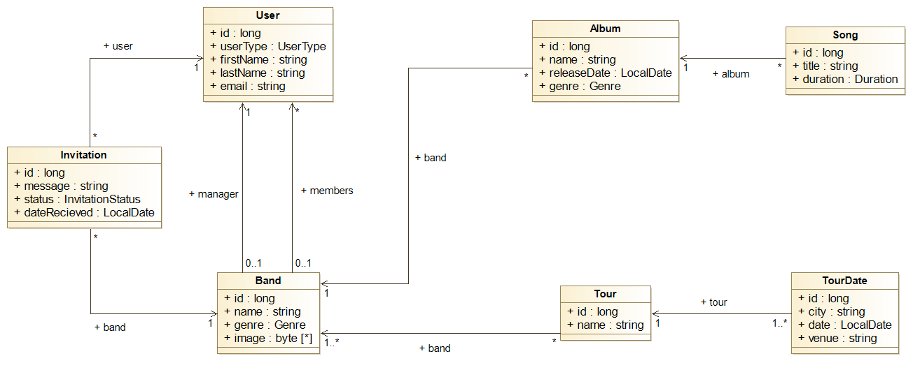

# YouBand Manager

*PA165 course - Spring 2023*

# How to run project
- Run command ```docker-compose up``` in root directory containing file *docker-compose.yml*.


# About project

-   **Name**: Music Band Manager
-   **Technologies**: Java 17, Apache Maven, Spring Boot, Apache Tomcat, Hibernate ORM, Postgres, pgAdmin, Grafana, Prometheus, Locust and Docker
-   **Developers**:
    -   Oskar Adam Válent @xvalent _Team Leader_
    -   Jakub Šušlík @xsuslik
    -   Patrik Čangel @xcangel
    -   Tomáš Koscielniak @xkosciel
-   **Assignment**: - The web application allows one music band to manage their activities. Managers can create a new band and hire team members from a catalog. They can set for the band the musical style (e.g., rock, pop, etc.), a name, and a logo. Band managers can add new albums and songs to a band. Each Song has a name and a duration. Managers can also schedule tours for the bands regarding dates and cities visited. Team members can log in to the system and see the offers made by the band managers. They can accept or reject being part of a band. After they are part of a band, they can see all the planned activities and the profiles of the other band members.

# Project Description

YouBand manager is a simple system for managing music bands, its memebers, albums, songs and tours.

## Modules

Project is composed of 4 runnable modules.

Runnable modules are in `module-core`, `module-user`, `module-email` and `module-pdf` folders.

* **module-core** (port 8080 in docker, exposed 8080): responsible for main functionality regarding band management.
* **module-user** (port 8080 in docker, exposed 8083): responsible for logging and registration of users.
* **module-email** (port 8080 in docker, exposed 8082): responsible for sending emails between users.
* **module-pdf** (port 8080 in docker, exposed 8081): responsible for generation of pdfs concerning band info and tours.


## Roles

The system has two authorization roles - **Manager** and **Band Member**.

-   Manager manages bands, their members, albums, songs, and band activities.
-   Band Member accepts invitations to bands and views band information. 


## Oauth2

You will receive oauth2 token following these steps

-   Run app test-client in root directory
-   Go to localhost:8084
-   You are redirected to MUNI
-   After successful login hit again localhost:8084 and you can copy your oauth2 token


## Runnable scenario

-   You can run scenario by filling ./locust/locustfile.py following instruction in file and by running command ```docker-compose up``` in locust directory
-   Then open localhost:8089 and fill pop up window by at least one user, request will run only once
-   Result is printed to console of locust-worker 

## Prometheus

-   Can be found on localhost:9090
-   After hitting status/targets, you can see all running modules  

## Grafana

-   Can be found on localhost:3000
-   Username is admin and password is admin 
-   You can see dashboard in menu/dashboards/Youband-manager dashboard
-   You can switch between module in left corner

## Entities

-   **User** - entity representing a user in the system. Is able to represent *Manager* as well as *Band Member*.
-   **Band** - entity representing a band.
-   **Album** - entity representing an album.
-   **Song** - entity representing a song.
-   **Tour** - entity representing a band tour.
-   **TourDate** - entity representing essential information about specific tour.
-   **Invitation** - entity representing an invitation to join a band.

## Seeding and cleaning the DB

In order to **seed the database**:

- Database `db_core` or `db_user` (depending on which database you want to seed) **must be** already running and 
container `core` or `user` (again, depending on which database you want to seed) must have run **at least once**
- For both requirements for both databases run `docker compose up` in project's root directory
- Navigate to either `module-core/src/db_utils/` or `module-user/src/db_utils/` depending on which database
you want to seed and run `docker compose up`, which will run the cleaning job first and then will seed the database

In order to run the cleaning and seeding jobs **manually**:
- Instead of running `docker compose up` in `module-core/src/db_utils/` or `module-user/src/db_utils/` run
`docker compose up db_cleaner` for cleaning the database and `docker compose up db_seeder` for seeding the database
- In the case of triggering the seeding job manually, it is advised to always call the cleaning job first and then the seeding job, since you would
populate the database with duplicit data if you would keep running the seed job only


## Use case diagram


## Class diagram


